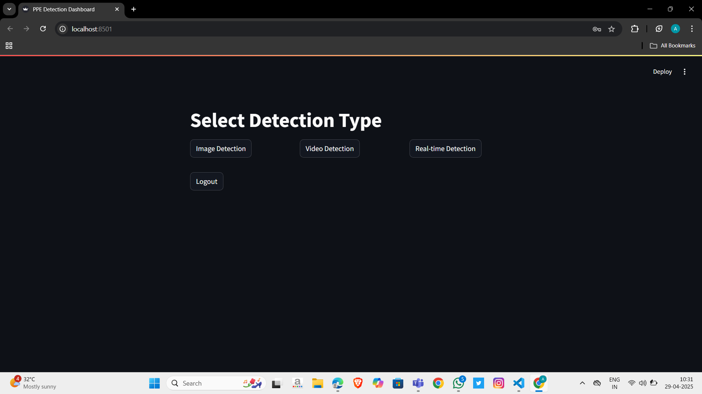
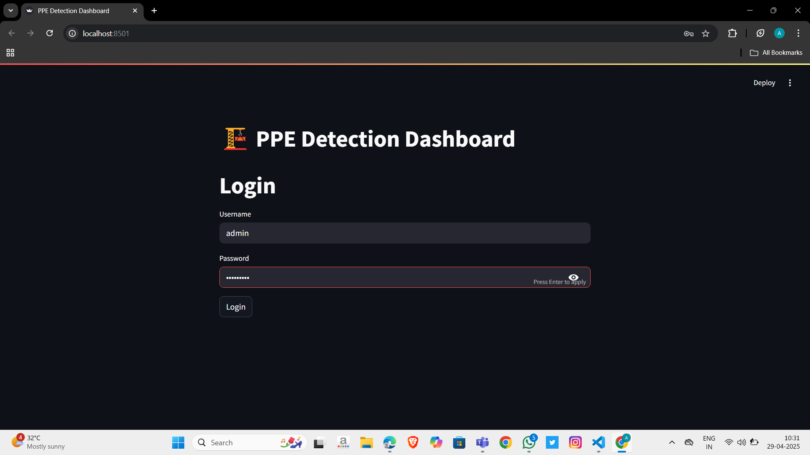
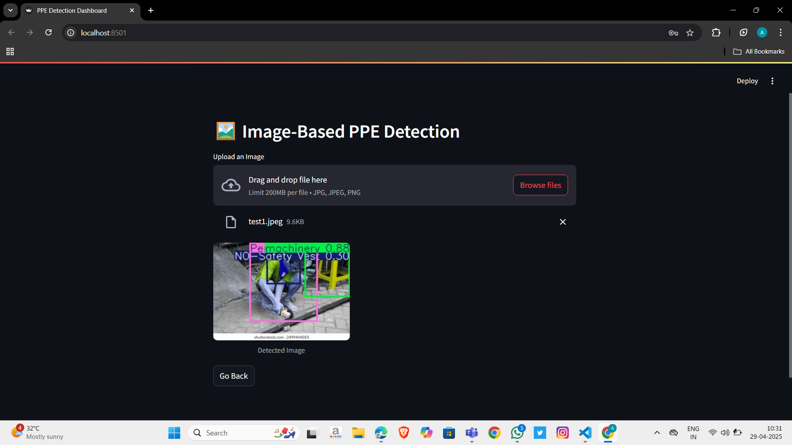
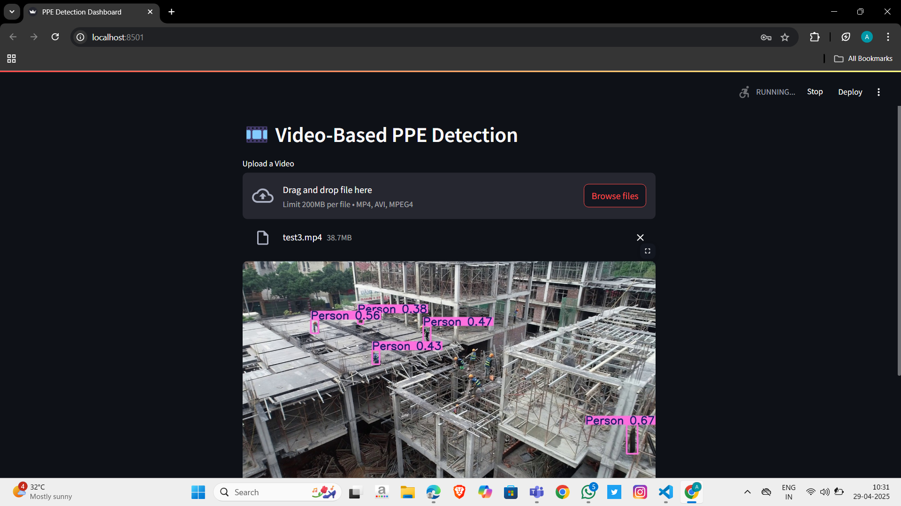
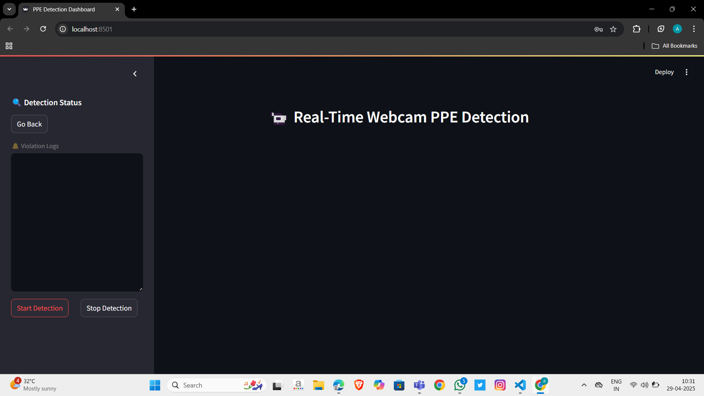

# 🦺 Construction PPE Detection System

A robust safety detection system using **YOLOv8** and **OpenCV** that identifies construction site workers who are not wearing safety helmets and vests. This project includes image-based, video-based, and real-time webcam detection, all wrapped into a clean, user-friendly **Streamlit** application with live dashboard and violation alerts.

> ✅ Entire project was built **from scratch** without AI coding tools. All implementations follow the official documentation of YOLOv8, OpenCV, and Streamlit.

---

## 🚧 Project Overview

Construction sites are high-risk environments, and enforcing proper **Personal Protective Equipment (PPE)** like helmets and safety vests is critical. This project is designed to:
- Detect missing helmets and vests in various formats (image, video, live feed).
- Provide real-time **alerts and dashboard analytics** for violations.
- Run as a lightweight, deployable **Streamlit app** with a smooth UI.

---

## ✨ Features

- 🖼 **Image-based Detection** — Upload static images to detect PPE compliance.
- 🎥 **Video-based Detection** — Analyze pre-recorded video for safety violations.
- 📹 **Real-time Detection (Webcam)** — Live monitoring with automatic alerts.
- 📊 **Live Dashboard** — Display real-time stats: total workers, violations, etc.
- 🔔 **Violation Alerts** — Instant flagging when helmet or vest is missing.
- ✅ **Streamlit UI** — Fully interactive web app with intuitive controls.
- 🔍 **Manual Implementation** — Coded entirely without AI assistance.

---

## 🔧 Tech Stack

| Technology     | Usage                                |
|----------------|--------------------------------------|
| `YOLOv8`       | Object detection for helmets & vests |
| `OpenCV`       | Image/video processing               |
| `Streamlit`    | Web app interface & live dashboard   |
| `Python`       | Core programming language            |

---

## 🚀 Setup Instructions

1. **Clone the Repository**
   ```bash
   git clone https://github.com/yourusername/ppe-detection.git
   cd ppe-detection
   ```

2. **Install Dependencies**
   *(preferably in a virtual environment)*
   ```bash
   pip install -r requirements.txt
   ```

3. **Download YOLOv8 Weights**
   - Get the official YOLOv8 pretrained weights from [Ultralytics](https://github.com/ultralytics/ultralytics).
   - Place them in the `weights/` folder.

4. **Run the Streamlit App**
   ```bash
   streamlit run app.py
   ```

---

## 🖼️ Sample Screenshots

### 🔍 Login Page


### 🧠 Select Detection Type


### 🎥 Image Detection


### 🎥 Video Detection


### 📈 Real-time Detection with Violation alert system and Dashboard


---

## 🎓 Learning Outcome

Through this project, I gained hands-on experience in:
- Deploying YOLOv8 in real-world object detection applications.
- Integrating computer vision with modern web frameworks like Streamlit.
- Building responsive UIs and real-time feedback systems.
- Structuring full-stack CV pipelines from scratch using only official documentation.

---

## 📬 Contact

**Ajay Rajan A**  
📍 Chennai, India  
📧 [ajayrajan727@gmail.com](mailto:ajayrajan727@gmail.com)  
🔗 [LinkedIn](https://linkedin.com/in/ajarajan05)  
💻 [GitHub](https://github.com/AjayRajan05)

---

## 📄 License

This project is licensed under the **MIT License**. Feel free to use, modify, and distribute it for educational or non-commercial use.

---

> *Built with precision, not automation — every line of code handcrafted to enforce safety and save lives.*
